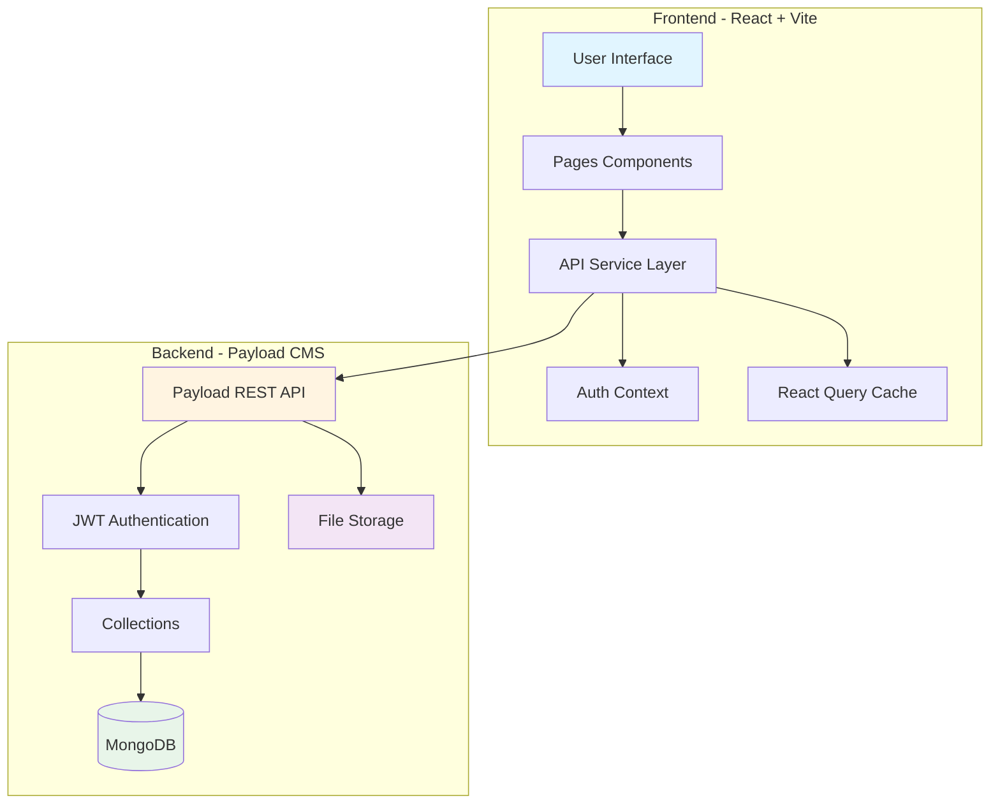
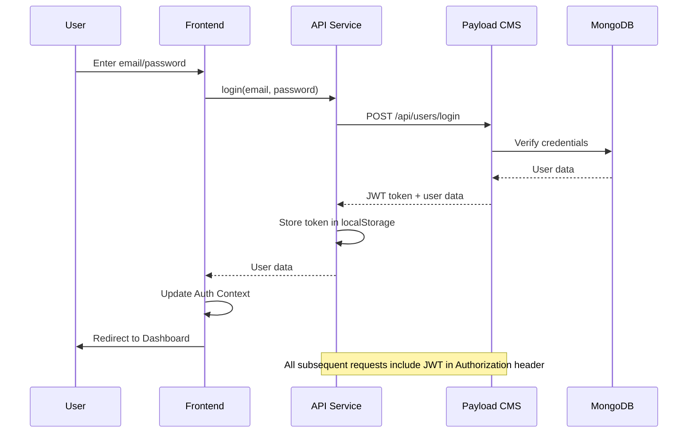
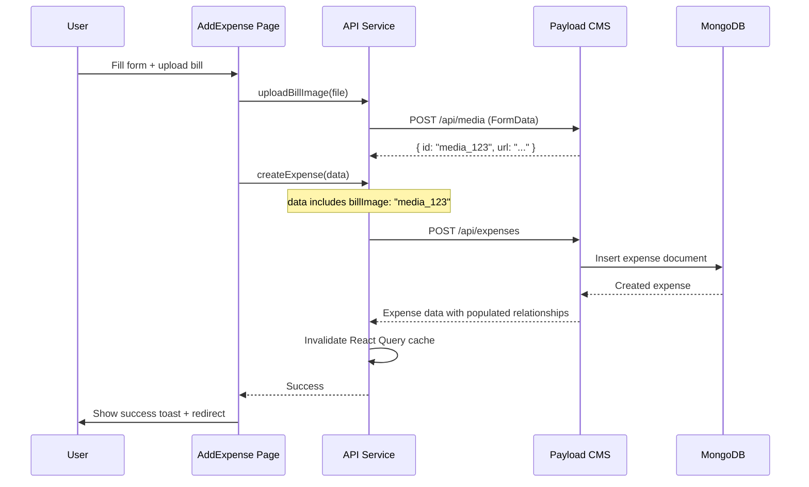
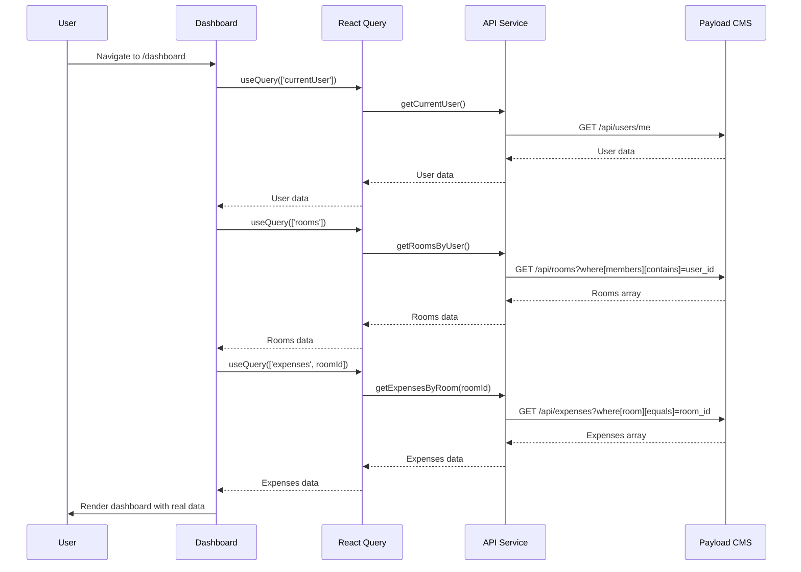
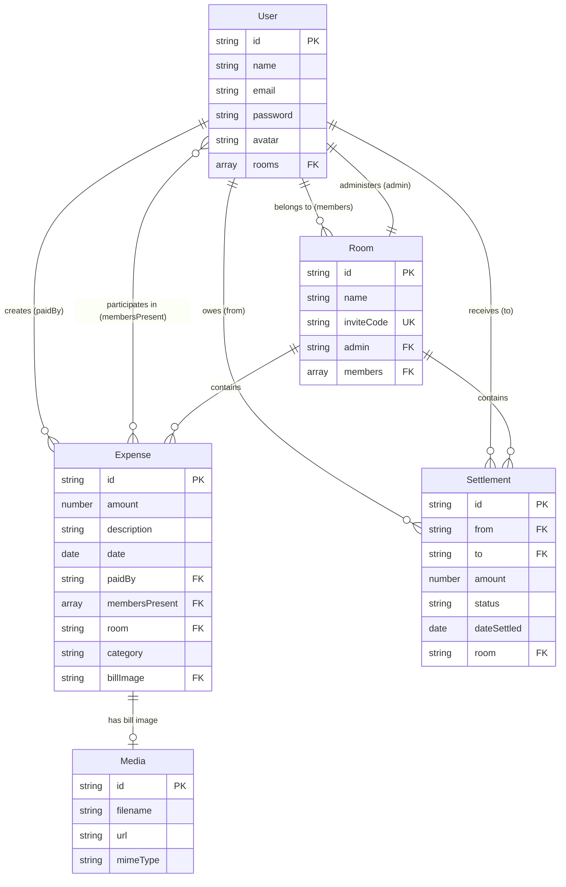

# MessBro Frontend-Backend Integration Architecture

This document explains how your React frontend will communicate with the Payload CMS backend.

---

## System Architecture



---

## Authentication Flow



---

## Data Flow Examples

### Creating an Expense



### Loading Dashboard Data



---

## API Endpoints Reference

### Authentication Endpoints

| Method | Endpoint | Purpose | Request Body | Response |
|--------|----------|---------|--------------|----------|
| POST | `/api/users/login` | Login user | `{ email, password }` | `{ token, user }` |
| POST | `/api/users` | Signup user | `{ name, email, password }` | `{ token, user }` |
| GET | `/api/users/me` | Get current user | - | `{ user }` |
| POST | `/api/users/logout` | Logout user | - | `{ message }` |

### Room Endpoints

| Method | Endpoint | Purpose | Request Body | Response |
|--------|----------|---------|--------------|----------|
| POST | `/api/rooms` | Create room | `{ name, admin, members }` | `{ doc }` |
| GET | `/api/rooms` | List rooms | Query params | `{ docs, totalDocs }` |
| GET | `/api/rooms/:id` | Get room | - | `{ doc }` |
| PATCH | `/api/rooms/:id` | Update room | `{ name?, members? }` | `{ doc }` |

### Expense Endpoints

| Method | Endpoint | Purpose | Request Body | Response |
|--------|----------|---------|--------------|----------|
| POST | `/api/expenses` | Create expense | `{ amount, description, ... }` | `{ doc }` |
| GET | `/api/expenses` | List expenses | Query params | `{ docs, totalDocs }` |
| GET | `/api/expenses/:id` | Get expense | - | `{ doc }` |
| PATCH | `/api/expenses/:id` | Update expense | `{ amount?, ... }` | `{ doc }` |
| DELETE | `/api/expenses/:id` | Delete expense | - | `{ message }` |

### Settlement Endpoints

| Method | Endpoint | Purpose | Request Body | Response |
|--------|----------|---------|--------------|----------|
| POST | `/api/settlements` | Create settlement | `{ from, to, amount, room }` | `{ doc }` |
| GET | `/api/settlements` | List settlements | Query params | `{ docs, totalDocs }` |
| PATCH | `/api/settlements/:id` | Update settlement | `{ status?, dateSettled? }` | `{ doc }` |

### Media Endpoints

| Method | Endpoint | Purpose | Request Body | Response |
|--------|----------|---------|--------------|----------|
| POST | `/api/media` | Upload file | FormData with file | `{ doc }` |
| GET | `/media/:filename` | Get file | - | File stream |

---

## Query Parameters

Payload CMS supports powerful query parameters:

### Filtering

```javascript
// Get expenses for a specific room
GET /api/expenses?where[room][equals]=room_123

// Get expenses for current month
GET /api/expenses?where[date][greater_than_equal]=2026-01-01&where[date][less_than]=2026-02-01

// Get pending settlements
GET /api/settlements?where[status][equals]=pending

// Get rooms where user is a member
GET /api/rooms?where[members][contains]=user_123
```

### Sorting

```javascript
// Sort by date descending (newest first)
GET /api/expenses?sort=-date

// Sort by amount ascending
GET /api/expenses?sort=amount
```

### Pagination

```javascript
// Get page 2 with 10 items per page
GET /api/expenses?page=2&limit=10
```

### Population (Include Related Data)

```javascript
// Get expenses with populated user data
GET /api/expenses?depth=1

// This will expand relationships like:
{
  paidBy: { id: "user_123", name: "Rahul", email: "..." }
  // instead of just: paidBy: "user_123"
}
```

---

## Request/Response Examples

### 1. Login Request

**Request**:
```http
POST http://localhost:3001/api/users/login
Content-Type: application/json

{
  "email": "rahul@email.com",
  "password": "password123"
}
```

**Response**:
```json
{
  "message": "Auth Passed",
  "user": {
    "id": "user_123",
    "email": "rahul@email.com",
    "name": "Rahul Sharma",
    "avatar": "R",
    "rooms": ["room_456"]
  },
  "token": "eyJhbGciOiJIUzI1NiIsInR5cCI6IkpXVCJ9...",
  "exp": 1706889600
}
```

### 2. Create Expense Request

**Request**:
```http
POST http://localhost:3001/api/expenses
Authorization: JWT eyJhbGciOiJIUzI1NiIsInR5cCI6IkpXVCJ9...
Content-Type: application/json

{
  "amount": 450,
  "description": "Groceries - Vegetables and fruits",
  "date": "2026-02-01T10:30:00.000Z",
  "paidBy": "user_123",
  "membersPresent": ["user_123", "user_456", "user_789"],
  "room": "room_456",
  "category": "groceries",
  "billImage": "media_789"
}
```

**Response**:
```json
{
  "message": "Created successfully",
  "doc": {
    "id": "expense_999",
    "amount": 450,
    "description": "Groceries - Vegetables and fruits",
    "date": "2026-02-01T10:30:00.000Z",
    "paidBy": {
      "id": "user_123",
      "name": "Rahul Sharma",
      "email": "rahul@email.com"
    },
    "membersPresent": [
      { "id": "user_123", "name": "Rahul Sharma" },
      { "id": "user_456", "name": "Amit Patel" },
      { "id": "user_789", "name": "Priya Singh" }
    ],
    "room": {
      "id": "room_456",
      "name": "Sunrise PG - Room 204"
    },
    "category": "groceries",
    "billImage": {
      "id": "media_789",
      "url": "http://localhost:3001/media/bill-image.jpg"
    },
    "createdAt": "2026-02-01T10:30:00.000Z",
    "updatedAt": "2026-02-01T10:30:00.000Z"
  }
}
```

### 3. Get Expenses for Room

**Request**:
```http
GET http://localhost:3001/api/expenses?where[room][equals]=room_456&sort=-date&limit=10
Authorization: JWT eyJhbGciOiJIUzI1NiIsInR5cCI6IkpXVCJ9...
```

**Response**:
```json
{
  "docs": [
    {
      "id": "expense_999",
      "amount": 450,
      "description": "Groceries - Vegetables and fruits",
      "date": "2026-02-01T10:30:00.000Z",
      "paidBy": { "id": "user_123", "name": "Rahul Sharma" },
      "membersPresent": [
        { "id": "user_123", "name": "Rahul Sharma" },
        { "id": "user_456", "name": "Amit Patel" }
      ],
      "category": "groceries"
    }
  ],
  "totalDocs": 1,
  "limit": 10,
  "totalPages": 1,
  "page": 1,
  "pagingCounter": 1,
  "hasPrevPage": false,
  "hasNextPage": false
}
```

---

## Data Relationships Diagram



---

## Frontend State Management

### Auth Context Structure

```typescript
interface AuthContextType {
  user: User | null;
  token: string | null;
  loading: boolean;
  login: (email: string, password: string) => Promise<void>;
  signup: (name: string, email: string, password: string) => Promise<void>;
  logout: () => void;
  isAuthenticated: boolean;
}
```

### React Query Keys

```typescript
// Organize query keys for easy invalidation
const queryKeys = {
  currentUser: ['currentUser'],
  rooms: ['rooms'],
  room: (id: string) => ['room', id],
  expenses: (roomId: string) => ['expenses', roomId],
  expensesByMonth: (roomId: string, month: string) => ['expenses', roomId, month],
  settlements: (roomId: string) => ['settlements', roomId],
};
```

---

## Error Handling

### Backend Error Responses

```json
{
  "errors": [
    {
      "message": "The following field is invalid: email",
      "field": "email"
    }
  ]
}
```

### Frontend Error Handling

```typescript
try {
  await createExpense(data);
  toast.success('Expense added successfully!');
} catch (error) {
  if (error.response?.data?.errors) {
    // Handle validation errors
    error.response.data.errors.forEach(err => {
      toast.error(err.message);
    });
  } else {
    // Handle general errors
    toast.error('Failed to create expense');
  }
}
```

---

## Security Considerations

### JWT Token Storage

```typescript
// Store in localStorage (simple but less secure)
localStorage.setItem('token', token);

// Or use httpOnly cookies (more secure, requires backend setup)
// The token is automatically sent with requests
```

### CORS Configuration

```typescript
// Backend: payload.config.ts
cors: ['http://localhost:5173', 'https://your-frontend.vercel.app']
```

### Access Control

```typescript
// Example: Users can only see expenses from their rooms
access: {
  read: ({ req: { user } }) => {
    if (!user) return false;
    return {
      room: {
        members: {
          contains: user.id
        }
      }
    };
  }
}
```

---

## Performance Optimization

### React Query Caching

```typescript
// Cache data for 5 minutes
const { data } = useQuery({
  queryKey: ['expenses', roomId],
  queryFn: () => getExpensesByRoom(roomId),
  staleTime: 5 * 60 * 1000, // 5 minutes
  cacheTime: 10 * 60 * 1000, // 10 minutes
});
```

### Pagination

```typescript
// Load expenses in pages
const { data, fetchNextPage, hasNextPage } = useInfiniteQuery({
  queryKey: ['expenses', roomId],
  queryFn: ({ pageParam = 1 }) => 
    getExpensesByRoom(roomId, { page: pageParam, limit: 20 }),
  getNextPageParam: (lastPage) => 
    lastPage.hasNextPage ? lastPage.page + 1 : undefined,
});
```

---

## Testing the Integration

### Manual Testing Checklist

- [ ] **Authentication**
  - [ ] Signup creates user in database
  - [ ] Login returns valid JWT token
  - [ ] Token is stored in localStorage
  - [ ] Protected routes redirect to login when not authenticated
  - [ ] Logout clears token

- [ ] **Rooms**
  - [ ] Create room generates unique invite code
  - [ ] Join room adds user to members
  - [ ] User can only see their rooms
  - [ ] Admin can update room settings

- [ ] **Expenses**
  - [ ] Create expense saves to database
  - [ ] Bill image uploads successfully
  - [ ] Expenses show only for user's rooms
  - [ ] Calculations are correct
  - [ ] Delete expense works

- [ ] **Settlements**
  - [ ] Settlements are calculated correctly
  - [ ] Mark as paid updates status
  - [ ] Balances update correctly

### API Testing Tools

**Using Thunder Client (VS Code Extension)**:
1. Install Thunder Client
2. Create collection "MessBro API"
3. Add requests for each endpoint
4. Save token as environment variable
5. Test all CRUD operations

**Using Payload Admin Panel**:
1. Visit `http://localhost:3001/admin`
2. Login with admin user
3. Create test data
4. Verify relationships
5. Test file uploads

---

## Troubleshooting Common Issues

### Issue: CORS Error

**Symptom**: `Access to fetch at 'http://localhost:3001/api/...' has been blocked by CORS policy`

**Solution**: 
```typescript
// In payload.config.ts
cors: ['http://localhost:5173']
```

### Issue: 401 Unauthorized

**Symptom**: API returns 401 even with token

**Solution**: Check Authorization header format:
```typescript
headers: {
  'Authorization': `JWT ${token}` // Note: "JWT" prefix, not "Bearer"
}
```

### Issue: Relationships Not Populated

**Symptom**: Getting IDs instead of full objects

**Solution**: Add `depth` parameter:
```typescript
GET /api/expenses?depth=1
```

### Issue: File Upload Fails

**Symptom**: 413 Payload Too Large

**Solution**: Increase payload size in server.ts:
```typescript
app.use(express.json({ limit: '10mb' }));
```

---

## Next Steps

1. ✅ Review this architecture document
2. ✅ Set up Payload CMS backend (Phase 1)
3. ✅ Create collections (Phase 2)
4. ✅ Test APIs using admin panel
5. ✅ Create API service layer in frontend
6. ✅ Update frontend pages one by one
7. ✅ Test integration thoroughly
8. ✅ Deploy to production

**Ready to start?** Begin with the [Implementation Plan](file:///C:/Users/moham/.gemini/antigravity/brain/6dcce844-9e08-4b38-8960-4ffeb4ba4cba/implementation_plan.md)! 🚀
